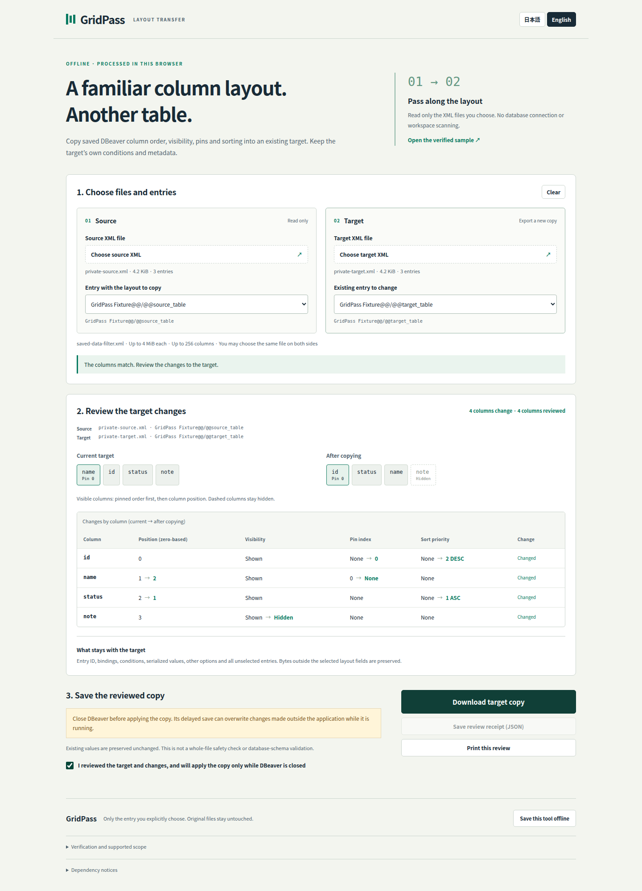

# GridPass

Copy a selected DBeaver saved column layout into an existing target entry,
without copying the source's conditions or replacing the target's bindings.
GridPass is a standalone offline JA/EN tool. It transfers column position,
visibility, pinning, sort priority and direction, while preserving every byte
outside the selected layout fields.

[Download the standalone HTML](dist/grid-pass.html) and open it locally. No
installation, account, database connection or hosting is required.

## Use

1. Start with trusted `saved-data-filter.xml` copies containing existing saved
   entries. DBeaver's **Save as default filter** creates those native entries.
2. Choose the source and target files explicitly, then select an entry on each
   side. You can choose the same file on both sides. GridPass never guesses an
   object ID, scans a workspace or constructs a new native entry.
3. Review the exact identities, before/after column arrangement and per-column
   changes. Names must match exactly, including their corresponding bindings.
4. Download the target copy and its JSON receipt. Keep the original as a backup.
   Apply the reviewed copy manually only while DBeaver is closed; its delayed
   save can otherwise overwrite external changes. The tool never applies files.

The source remains read-only. The target's object ID, bindings, conditions,
opaque values, other options and unselected entries remain unchanged. An
unchanged layout produces a byte-identical copy. Receipts record input/output
hashes, selected identities and every before/after column setting.

## Bounded input and privacy

- UTF-8 XML 1.0, up to 4 MiB per file, 512 saved entries and 256 ordinary flat
  columns in a selected entry. Positions are a complete zero-based permutation.
- Exact unique column/binding names, unique active sort priorities and visible,
  distinct pin indices. Valid gaps in pin indices are preserved.
- Pin strings must match the finite canonical Java Integer 0–255 whitelist.
  **GridPass never Java-deserializes input.** Other target values stay opaque.
- Unknown selected structures, DTD/entity declarations, namespaces, ambiguous
  identities and noncanonical pins fail closed. Quoted-name distinctions and
  nested/pseudo-column layouts are outside the supported profile.
- The inert parser bounds depth, elements, attributes and tokens before DOM
  parsing. No SQL execution, source-expression copying, network request, native
  launch, automatic installation or real workspace access is part of the tool.

This is not database-schema validation or a whole-file security certification.
Existing serialized target values are preserved, not sanitized. Use trusted
files. Imported content is rendered as text, retained only in page memory, and
excluded from the clean offline-tool copy. Changed selections and delayed reads
or hash jobs cannot reuse an old confirmation, receipt or download.

## Verified behavior

The implemented UI and its actual browser download were independently accepted
at `804bbe986a49c19fa26fecfd4222b1351f1ccaac`:

- [Browser → official DBeaver gate](https://github.com/Masanori-Spec/grid-pass/actions/runs/37577834267):
  34 browser cases, exact downloaded XML/receipt routing, native GUI load,
  save/fresh reopen and four exact fault controls
- [Native-only gate](https://github.com/Masanori-Spec/grid-pass/actions/runs/37577834260):
  the same six native cases; both runs together have 14 clean native exits
- 75 core tests, nine independent byte/normalization fault controls, bounded
  startup-helper checks, sandboxed Chrome 154.0.8037.57, no page/console errors
  and no application network requests
- JA/EN desktop and 320/390px mobile review, keyboard file chooser/export/reset,
  reachable table columns, same-file reselection, stale asynchronous operations,
  clean offline reopen and complete one-page fixture print reviews

Native testing uses official DBeaver CE 26.2.2, its verified bundled Java and
pinned Xerial SQLite JDBC 3.53.4.0 with original synthetic data only. Arbitrary
user files are never submitted to the native test consumer. No vendor binaries,
compiled classes, database files, profiles or credentials are shipped.

The product output preserves protected bytes. Later native saves omit exactly
eight explicit false pseudo-column flags on unopened source/unrelated bindings
in the fixture; all other protected semantics remain exact. Prior native
verification attempts also encountered GTK startup crashes. Their cause is
unestablished and their failures remain recorded. The bounded X11 startup
settling change is an experiment, not a proven native crash fix or a general
stability guarantee.

See [release evidence and limits](docs/release.md),
[the native checkpoint and failed attempts](docs/native-checkpoint.md),
[the acceptance contract](docs/native-contract.md), and
[exact evidence provenance](docs/evidence-provenance.json).

## Development

Use Node 22. `npm ci --ignore-scripts`, `npm run verify`,
`python3 scripts/verify-layout.py selftest`, and
`python3 test/startup-diagnostics.py` cover the local source checks.
`npm run build` reproducibly writes `dist/grid-pass.html`. Browser and native GUI
checks run in the hosted workflows with the sandbox enabled and disposable
synthetic workspaces.

Original code and synthetic fixtures have no reuse license grant. Dependency
ownership and license notices apply only to their dependencies:
[THIRD_PARTY_NOTICES.txt](THIRD_PARTY_NOTICES.txt).
